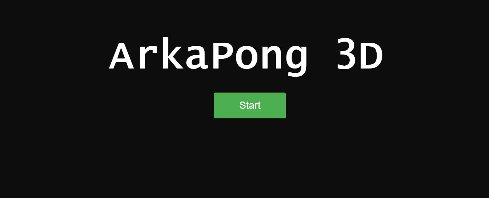
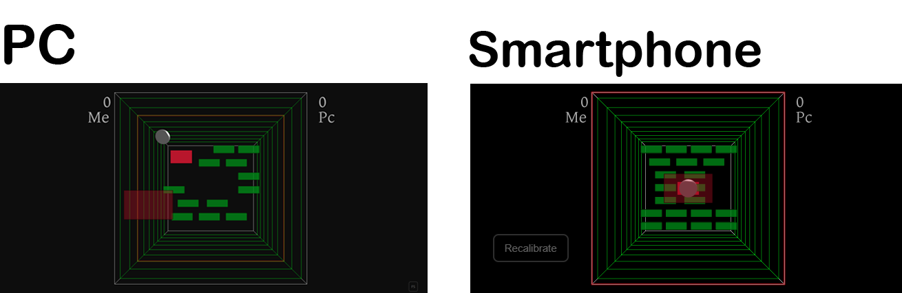
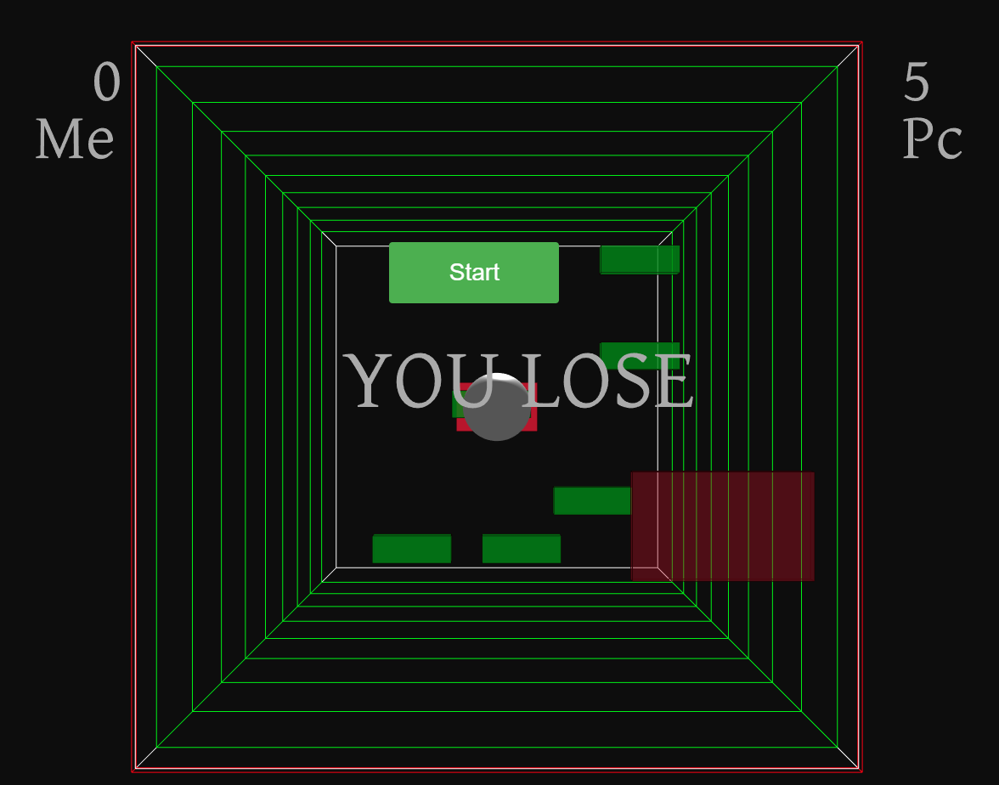

# ArkaPong-3D
Project for the Programming of Interfaces Course in Bachelor Degree at University of Pisa

Little game that combines Pong and Arkanoid. Made with Three.js

<h1>Current objectives </h1>
  
 <ul> <li> Add comments 
  
 <li> Improve the GUI 
  
 <li> Add a complete compatibility with phones </ul>
  
 <h2> Goals
 
  <ul > <li>Motion controlls with phone </ul>
  
  <h2>Demo</h2>
  
A live demo will soon be available
  
<h2>Schreenshoot</h1>

