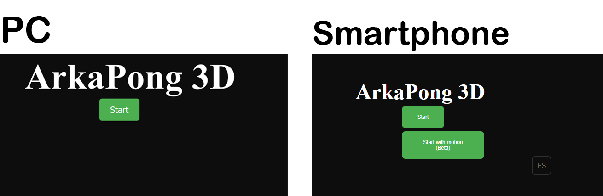

# ArkaPong-3D
Project for the Programming of Interfaces Course in Bachelor Degree at University of Pisa

Little game that combines Pong and Arkanoid. Made with Three.js

<h1>Features </h1>
  
 <ul> <li> Play with Dekstop Browser or Mobile Browser (better if Chrome) 
  
 <li> Pay with mouse, keyboard (wasd), finger, motion control
    
 <h2> To fix</h2>
 
  <ul > <li>Improve Motion controlls  </ul>
 
 <li> No Audio on Mozilla
  
  <h2>Demo</h2>
  
<a href="http://www.gbarreca.com">Here</a> a live demo
  
<h2>Schreenshoot</h1>

